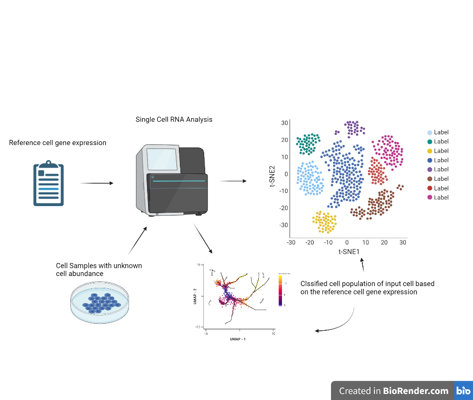

<!-- README.md is generated from README.Rmd. Please edit that file -->

# RASC

<!-- badges: start -->
<!-- badges: end -->

The objective of the tool is to reproduce and improve the workflow of
the single cell RNA analysis which includes processing and filtering the
data, calculating dimension reduction, unsupervised clustering,and cell
type annotation. The goal of scRNA analysis is to do clustering and
classifying cells at single cell level. It will perform analysis on the
gene expression in every cell with a reference, then annotating the
corresponding cell types.The reference should includes the unique gene
expression of different cell type. The improvement would be done in the
labeling of cell type part. For existing scRNA analysis tool such as
Deseq2, they labelled the cell types based on reference signature and
the score of each reference gene based on the similarity between sample
cells and reference cell’s gene expression. For example, they will label
the cell as type A because this cell mostly resemble gene expression of
cell A. Yet, in some circumstances, some cells don’t resemble any cells,
so they will have a very low score for every reference cell types.
However, due to the property of the algorithm, they will still be
labeled with highest score of reference cells they resemble. Thus, some
weird cells might be filtered or marked as normal cells. My package will
fix this problem by calculating the average of the similarity score and
finds cell that has low scores and relabeling them with AUcell to make
the cell annotation part more accurate. The version of R is 4.1.0 and
the platform used for this package is windows

## Installation

You can install the development version of RASC like so:

``` r
require("devtools")
devtools::install_github("MengyiShu/RASC", build_vignettes = TRUE)
library("RASC")
```

To run the shinyApp: Under construction

## Overview

``` r
ls("package:RASC")
data(package = "RASC")
```

An overview of the package is illustrated below:
<!--  -->

``` r
browseVignettes("<PackageName>")
```

## Reference

## Acknowledgements

This package was developed as part of an assessment for 2021 BCB410H:
Applied Bioinformatics, University of Toronto, Toronto, CANADA.
